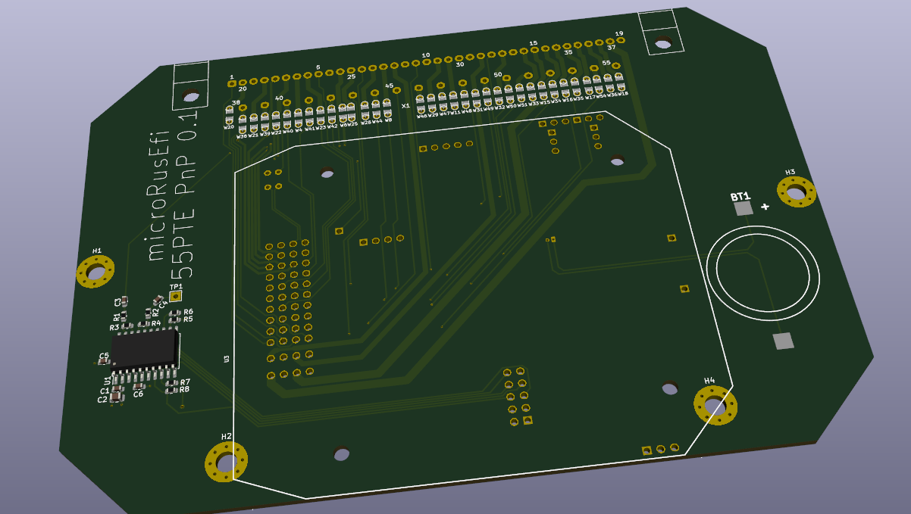

[rusEfi](https://github.com/rusefi/rusefi) PnP ECU for 55 pin TE 963063.

This board is a direct swap for OEM Yanvar and Mikas case. This adapter uses [microRusEfi](https://github.com/rusefi/hw_microRusEfi) as brain module.

* X injectors

* Y igniters

* 1xVR input

